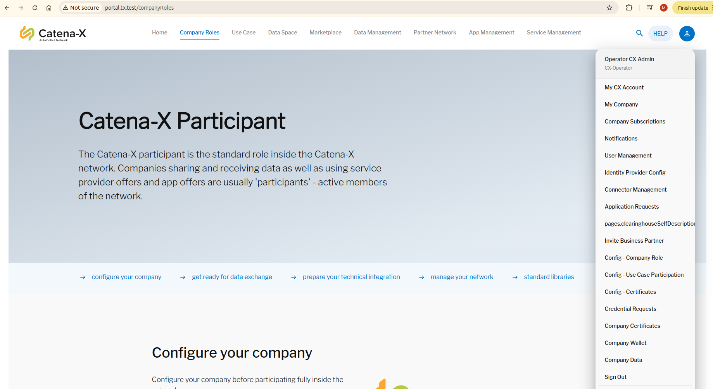

# Tractus-X Umbrella - Manual Installation Guide

This repository contains a complete deployment setup for the **Tractus-X Umbrella** (Catena-X automotive dataspace) using Kubernetes, Helm, and HashiCorp Vault for secure secret management.

## 🏗️ Architecture Overview

The Tractus-X Umbrella provides a foundation for running end-to-end tests or creating sandbox environments of the [Catena-X](https://catena-x.net/en/) automotive dataspace using [Eclipse Tractus-X](https://projects.eclipse.org/projects/automotive.tractusx) OSS components.


### Key Components:
- **Kubernetes Cluster**: Minikube-based local development environment
- **Secrets Management**: HashiCorp Vault for secure secret storage
- **Helm Charts**: Umbrella chart with multiple Tractus-X components
- **Custom Services**: Local patches for discoveryfinder, bpndiscovery, and semantic-hub

## 📋 Prerequisites

### Required Tools
Before starting the installation, ensure you have the following tools installed:

**Tested Versions:**
- **Helm**: v3.18.3
- **Docker**: 28.3.1
- **Terraform**: v1.12.2
- **Minikube**: v1.36.0
- **kubectl**: v1.33.1

**Minimum Requirements:**
- **CPU**: 8 cores
- **Memory**: 16GB RAM
- **Storage**: 20GB free space

### Required Software
- [Minikube](https://minikube.sigs.k8s.io/docs/start/) - Local Kubernetes cluster (v1.36.0+)
- [kubectl](https://kubernetes.io/docs/tasks/tools/) - Kubernetes command-line tool (v1.33.1+)
- [Helm](https://helm.sh/docs/intro/install/) - Kubernetes package manager (v3.18.3+)
- [Docker](https://docs.docker.com/get-docker/) - Container runtime (28.3.1+)
- [Terraform](https://developer.hashicorp.com/terraform/downloads) - Infrastructure as Code (v1.12.2+, optional)

## 🚀 Installation Options

You have two options for deploying the Tractus-X Umbrella:

1. **[Manual Installation](#manual-installation-steps)** - Step-by-step manual setup
2. **[Automatic Installation](#automatic-installation-with-terraform-and-argocd)** - Automated setup using Terraform and ArgoCD

### Manual Installation Steps

### Step 1: Start Minikube Kubernetes Cluster

```bash
# Start Minikube with required resources
minikube start --cpus=8 --memory=16gb --profile='tractus-x'

# Set the profile
minikube profile tractus-x

# Enable required addons
minikube addons enable metrics-server
minikube addons enable ingress
minikube addons enable ingress-dns

# Create required namespaces
kubectl create ns vault
kubectl create ns umbrella
```

### Step 2: Configure DNS Entries

Get your Minikube IP and add the following entries to your `/etc/hosts` file:

```bash
# Get Minikube IP
minikube ip
```

Edit `/etc/hosts` file (requires sudo on Linux/macOS):

```bash
sudo nano /etc/hosts
```

Add the following entries (replace `<MINIKUBE_IP>` with your actual Minikube IP):

```
<MINIKUBE_IP> portal.tx.test
<MINIKUBE_IP> portal-backend.tx.test
<MINIKUBE_IP> centralidp.tx.test
<MINIKUBE_IP> sharedidp.tx.test
<MINIKUBE_IP> dataprovider-controlplane.tx.test
<MINIKUBE_IP> dataprovider-dataplane.tx.test
<MINIKUBE_IP> dataconsumer-1-controlplane.tx.test
<MINIKUBE_IP> dataconsumer-1-dataplane.tx.test
<MINIKUBE_IP> dataconsumer-2-controlplane.tx.test
<MINIKUBE_IP> dataconsumer-2-dataplane.tx.test
<MINIKUBE_IP> semantics.tx.test
<MINIKUBE_IP> business-partners.tx.test
<MINIKUBE_IP> ssi-dim-wallet-stub.tx.test
<MINIKUBE_IP> bdrs-server.tx.test
<MINIKUBE_IP> pgadmin4.tx.test
<MINIKUBE_IP> smtp.tx.test
<MINIKUBE_IP> sdfactory.tx.test
<MINIKUBE_IP> ssi-credential-issuer.tx.test
<MINIKUBE_IP> dataprovider-submodelserver.tx.test
<MINIKUBE_IP> dataprovider-dtr.tx.test
<MINIKUBE_IP> vault.tx.test
<MINIKUBE_IP> dataprovider-dtr.test
<MINIKUBE_IP> argo.tx.test
```

### Step 3: Install and Configure Vault

```bash
# Navigate to vault directory
cd vault

# Make the installation script executable
chmod +x install_vault.sh

# Run the Vault installation script
./install_vault.sh
```

The script will automatically:
- Install HashiCorp Vault using Helm
- Initialize Vault with 5 unseal keys (threshold: 3)
- Unseal Vault using the first 3 keys
- Configure KV secrets engine
- Create secrets for EDC components
- Set up access policies and tokens
- Generate `vault-edc-token-secret.yaml`

After the script completes, apply the generated secret to the umbrella namespace:

```bash
# Apply the Vault token secret to umbrella namespace
kubectl -n umbrella apply -f vault-edc-token-secret.yaml
```

### Step 4: Install Tractus-X Umbrella

You have two options for deployment:

#### Option A: Standard Deployment (tx-data-provider)
```bash
# Navigate to the umbrella chart directory
cd charts/umbrella

# Update Helm dependencies
helm dependency update

# Install the umbrella chart with development values
helm install umbrella . -f values-dev.yaml -n umbrella --create-namespace --timeout 15m
```

#### Option B: Eclipse EDC Deployment (Built from Source)
```bash
# Navigate to the umbrella chart directory
cd charts/umbrella

# Update Helm dependencies
helm dependency update

# Install the umbrella chart with Eclipse EDC values
helm install umbrella . -f values-eclipse-edc.yaml -n umbrella --create-namespace --timeout 15m
```

The Eclipse EDC deployment uses custom EDC images(nuruldhamar/edc-dataplane
, nuruldhamar/edc-controlplane
) built from the [Eclipse EDC Connector](https://github.com/eclipse-edc/Connector) source code, replacing the standard `tx-data-provider` component.


For automated deployment using Infrastructure as Code (IaC) and GitOps, follow these steps(added support only for tractusx-umbrella):

#### Prerequisites for Automatic Setup

```bash
# Ensure Terraform is installed and configured
terraform version

# Verify you have access to the repository
git clone https://github.com/aminshuvo/tractus-x-umbrella-umbrella.git
cd tractus-x-umbrella-umbrella
```

#### Step 1: Initialize and Apply Terraform

```bash
# Navigate to terraform directory
cd terraform

# Initialize Terraform
terraform init

# Plan the deployment
terraform plan

# Apply the infrastructure
terraform apply
```

The Terraform configuration will automatically:
- Create and configure Minikube cluster with required resources
- Set up required namespaces (vault, umbrella, argocd)
- Install and configure HashiCorp Vault
- Install ArgoCD with ingress configuration
- Apply ArgoCD applications and repositories
- Generate hosts file entries

#### Step 2: Configure DNS Entries

After Terraform completes, add the generated hosts entries to your `/etc/hosts` file:

```bash
# View the generated hosts entry
cat terraform/hosts_entry.txt

# Add to /etc/hosts (copy the output from above command)
sudo nano /etc/hosts
```

#### Step 3: Access ArgoCD and Monitor Deployment

```bash
# Get ArgoCD access information
echo "ArgoCD URL: http://argo.tx.test"
echo "Username: admin"
echo "Password: admin123 (configured in Terraform)"

# Check ArgoCD application status
kubectl get applications -n argocd

# Monitor the umbrella application
kubectl describe application umbrella -n argocd
```

#### Step 4: Verify Deployment

```bash
# Check all pods in umbrella namespace
kubectl get pods -n umbrella

# Check ArgoCD sync status
kubectl get applications -n argocd -o wide
```

### GitOps Workflow

The automatic setup uses ArgoCD for GitOps deployment:


1. **Repository**: `https://github.com/aminshuvo/tractus-x-umbrella-umbrella.git`
2. **Branch**: `main`
3. **Path**: `charts/umbrella`
4. **Values**: `values-dev.yaml`
5. **Sync Policy**: Automated with self-healing enabled

#### ArgoCD Application Configuration

The ArgoCD application is configured with:
- **Automated sync**: Enabled with prune and self-heal
- **Sync options**: CreateNamespace, PrunePropagationPolicy, ServerSideApply
- **Retry policy**: 5 attempts with exponential backoff
- **Ignore differences**: Resource requirements and replicas for dev environment

## 🔧 Configuration

### Values Files

The installation supports multiple deployment configurations:

#### Standard Deployment (`values-dev.yaml`)
- Portal configuration with backend services
- Central and Shared IDP setup
- EDC data provider and consumer components (tx-data-provider)
- Semantic Hub and Business Partner Discovery
- SSI Credential Issuer
- Observability components (Prometheus, Grafana, Jaeger)

#### Eclipse EDC Deployment (`values-eclipse-edc.yaml`)
- Portal configuration with backend services
- Central and Shared IDP setup
- **Eclipse EDC Connector** (built from Eclipse EDC source)
- Digital Twin Registry and Simple Data Backend
- **Disabled**: Heavy components (semantic-hub, bpndiscovery, etc.) for resource optimization

### Eclipse EDC Connector

The Eclipse EDC Connector is a replacement for the standard `tx-data-provider` component, built directly from the [Eclipse EDC Connector](https://github.com/eclipse-edc/Connector) source code.

**Available Builds:**
- **Standard Eclipse EDC**: Uses `nuruldhamar/edc-controlplane` and `nuruldhamar/edc-dataplane` images
- **Custom EDC Build**: Uses your own images built from [https://github.com/aminshuvo/edc-connector](https://github.com/aminshuvo/edc-connector)

**Key Features:**
- **Control Plane**: Manages data transfers, policies, and connector configuration
- **Data Plane**: Handles actual data transfer operations
- **Eclipse EDC Images**: Uses `nuruldhamar/edc-controlplane` and `nuruldhamar/edc-dataplane` (or your custom images)
- **Vault Integration**: Integrates with HashiCorp Vault for secret management
- **Tractus-X Compatibility**: Configured to work with Tractus-X IAM and BDRS

**Access Points:**
- **Control Plane**: `http://eclipse-edc-controlplane.tx.test`
- **Data Plane**: `http://eclipse-edc-dataplane.tx.test`
- **DSP Endpoint**: `http://eclipse-edc-controlplane.tx.test/api/v1/dsp`
- **Management API**: `http://eclipse-edc-controlplane.tx.test/management`

**Custom Build Instructions:**
To use your own EDC build from [https://github.com/aminshuvo/edc-connector](https://github.com/aminshuvo/edc-connector):

1. Clone and build your EDC connector:
   ```bash
   git clone https://github.com/aminshuvo/edc-connector.git
   cd edc-connector
   # Build your control plane and data plane images
   ```

2. Push images to your registry and update `values-eclipse-edc.yaml`:
   ```yaml
   eclipse-edc:
     controlplane:
       image:
         repository: your-registry/edc-controlplane
         tag: your-tag
     dataplane:
       image:
         repository: your-registry/edc-dataplane
         tag: your-tag
   ```

3. Deploy using Option C from the installation steps above.

For more details, see the [Eclipse EDC Chart Documentation](charts/eclipse-edc/README.md).

### Local Patches
This repository includes local patches for:
- **discoveryfinder**: Local patched version for enhanced discovery capabilities
- **bpndiscovery**: Local patched version for business partner discovery
- **semantic-hub**: Local patched version for semantic data management

## 🌐 Accessing Services

Once deployed, you can access the following services:



| Service | URL | Description |
|---------|-----|-------------|
| Portal | http://portal.tx.test | Main portal interface |
| Portal Backend | http://portal-backend.tx.test | Portal backend API |
| Central IDP | http://centralidp.tx.test | Central Identity Provider |
| Shared IDP | http://sharedidp.tx.test | Shared Identity Provider |
| Vault | http://vault.tx.test | HashiCorp Vault UI |
| PgAdmin | http://pgadmin4.tx.test | Database administration |
| Semantic Hub | http://semantics.tx.test | Semantic data management |
| **ArgoCD** | http://argo.tx.test | GitOps deployment management |
| **Eclipse EDC Control Plane** | http://eclipse-edc-controlplane.tx.test | Eclipse EDC Control Plane |
| **Eclipse EDC Data Plane** | http://eclipse-edc-dataplane.tx.test | Eclipse EDC Data Plane |

### ArgoCD Access Information

- **URL**: http://argo.tx.test
- **Username**: admin
- **Password**: `kubectl -n argocd get secret argocd-initial-admin-secret -o jsonpath='{.data.password}' | base64 -d; echo`

## 🔍 Monitoring and Troubleshooting

### Check Pod Status
```bash
# Check all pods in umbrella namespace
kubectl get pods -n umbrella

# Check specific component pods
kubectl get pods -n umbrella | grep discoveryfinder
kubectl get pods -n umbrella | grep bpndiscovery
```

### View Logs
```bash
# View logs for a specific pod
kubectl logs -n umbrella <pod-name>

# Follow logs in real-time
kubectl logs -f -n umbrella <pod-name>
```

### Common Issues

#### 1. CreateContainerConfigError
If pods fail with `CreateContainerConfigError`, check for missing secrets:
```bash
# Check if required secrets exist
kubectl get secrets -n umbrella

# Common missing secrets that need to be created manually:
# - secret-discoveryfinder-postgres-init
# - secret-bpndiscovery-postgres-init
```

#### 2. Vault Connection Issues
```bash
# Check Vault status
kubectl exec -n vault deployment/vault -- vault status

# Check Vault logs
kubectl logs -n vault deployment/vault
```

#### 3. DNS Resolution Issues
```bash
# Test DNS resolution
nslookup portal.tx.test
ping portal.tx.test

# Verify hosts file entries
cat /etc/hosts | grep tx.test
```

#### 4. ArgoCD Sync Issues
```bash
# Check ArgoCD application status
kubectl get applications -n argocd

# Check ArgoCD application details
kubectl describe application umbrella -n argocd

# Check ArgoCD logs
kubectl logs -n argocd -l app.kubernetes.io/name=argocd-application-controller

# Force sync if needed
kubectl patch application umbrella -n argocd --type='merge' -p='{"spec":{"syncPolicy":{"automated":{"prune":true,"selfHeal":true}}}}'

# Retrieve the initial ArgoCD admin password (most reliable for new installs)
kubectl -n argocd get secret argocd-initial-admin-secret -o jsonpath='{.data.password}' | base64 -d; echo
# If you have changed or upgraded, try the main secret
kubectl -n argocd get secret argocd-secret -o jsonpath='{.data.admin\.password}' | base64 -d; echo
```

#### 5. Terraform Issues
```bash
# Check Terraform state
terraform show

# Check Terraform plan
terraform plan

# Reset Terraform state if needed
cd terraform
rm -f terraform.tfstate*
terraform init
```

## 🧹 Cleanup

### Manual Installation Cleanup

To clean up the manual deployment:

```bash
# Uninstall the umbrella chart
helm uninstall umbrella -n umbrella

# Delete namespaces
kubectl delete ns umbrella
kubectl delete ns vault

# Stop and delete Minikube cluster
minikube stop --profile='tractus-x'
minikube delete --profile='tractus-x'

# Remove hosts file entries (manually edit /etc/hosts)
```

### Automatic Installation Cleanup

To clean up the Terraform-managed deployment:

```bash
# Navigate to terraform directory
cd terraform

# Destroy all Terraform-managed resources
terraform destroy

# This will automatically:
# - Delete ArgoCD applications
# - Uninstall ArgoCD
# - Uninstall Vault
# - Delete namespaces
# - Stop and delete Minikube cluster
```

### Reset Terraform State (if needed)

If you need to completely reset the Terraform state:

```bash
# Navigate to terraform directory
cd terraform

# Remove Terraform state files
rm -f terraform.tfstate*

# Reinitialize Terraform
terraform init
```
